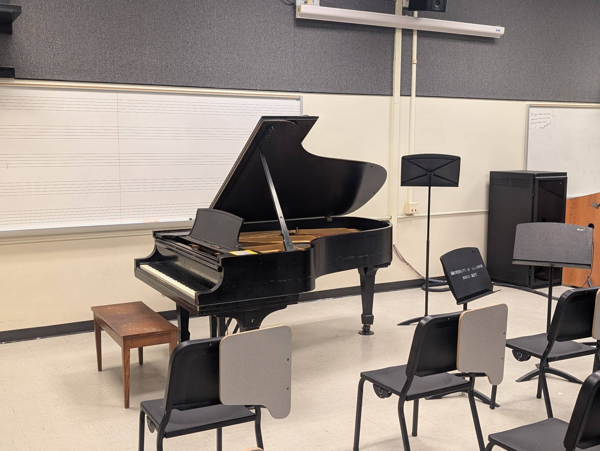

Fishbowl (0359)
---------------

Playability: 4.

Steinway Model B.

The tone and dynamic range are quite good. Loud playing sounds very sonorous,
and melody notes stand out from the accompaniment. Tone is on the brilliant
side, so quiet playing is not particularly mellow. The action also doesn't
respond perfectly to soft playing, so intricate passages can sound uneven in
tone.

*Last updated: Feb 4, 2026*

.. audio:: ../_static/audio/musicbldg/0359.mp3

   Liszt Petrarch Sonnet 2:

