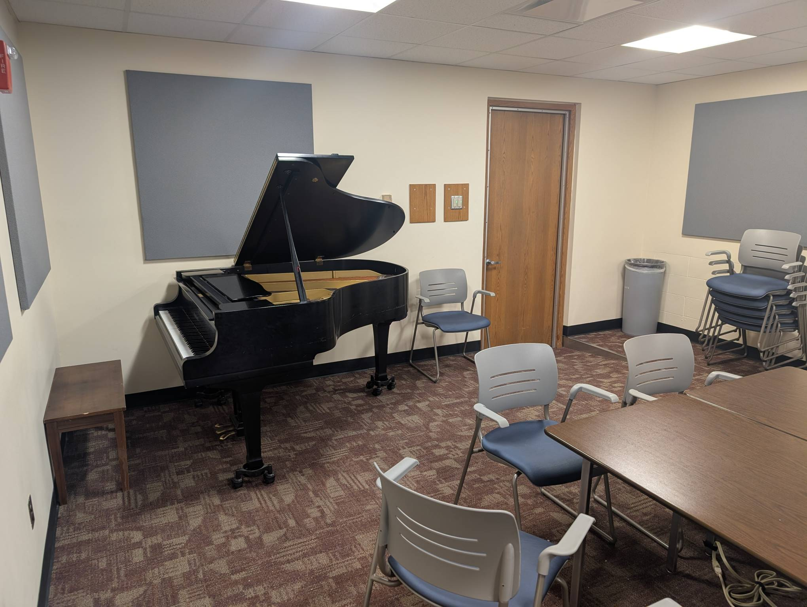

Seminar Room (2334)
-------------------

Playability: 3.

Yamaha G2.

Tone is slightly harsh. Action feels a bit stiff. These two combined make it
difficult to play quietly. Loud tone is decent, and loud playing rings over the
accompaniment well.

*Last updated: Feb 4, 2026*

.. audio:: ../_static/audio/musicbldg/2334.mp3

   Liszt Petrarch Sonnet 1:

