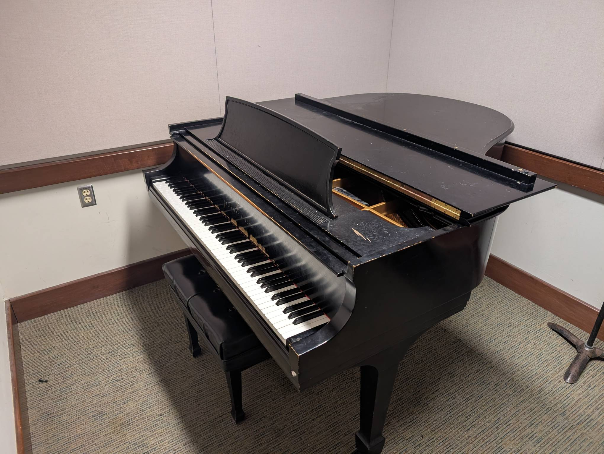

Rm 307
------

Playability: 3.

Steinway Model M.

Voicing is even. Can play quietly with good tone. Notes tend to become harsh
quickly as volume increases. Loud tone is good.

*Last updated: Jan 25, 2026*

.. audio:: ../_static/audio/smith/307.mp3

   Rach 3:

