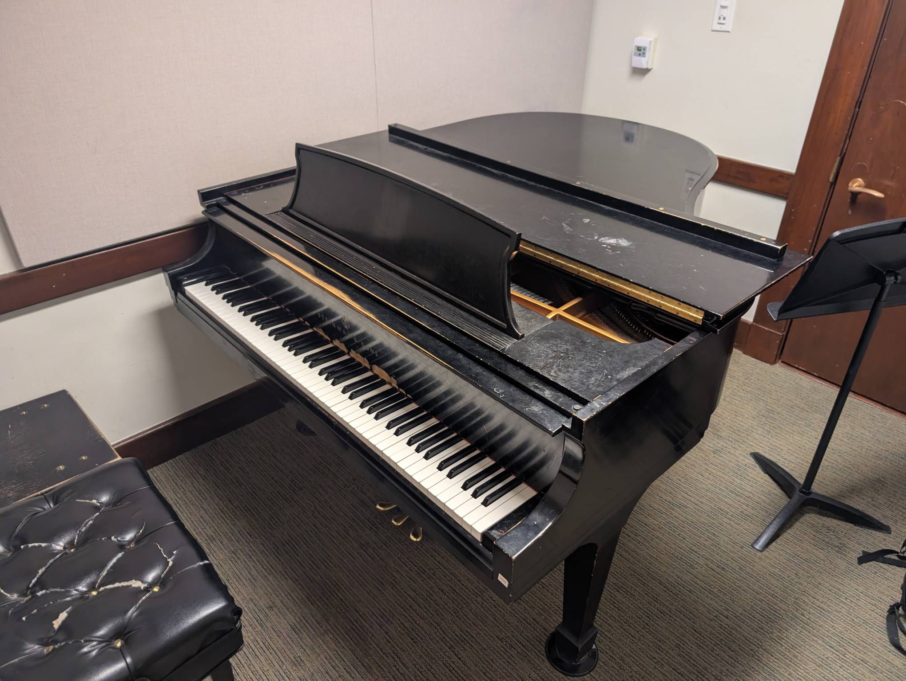

Rm 311
------

Playability: 2.

Steinway Model M.

Voicing is slightly too soft, and uneven. Treble notes especially sound muted
even when played with large force. Bass notes sound mellow, but not brilliant.
The action makes a knocking noise when certain keys are played.

*Last updated: Jan 31, 2026*

.. audio:: ../_static/audio/smith/311.mp3

   Liszt Petrarch Sonnet 1:

