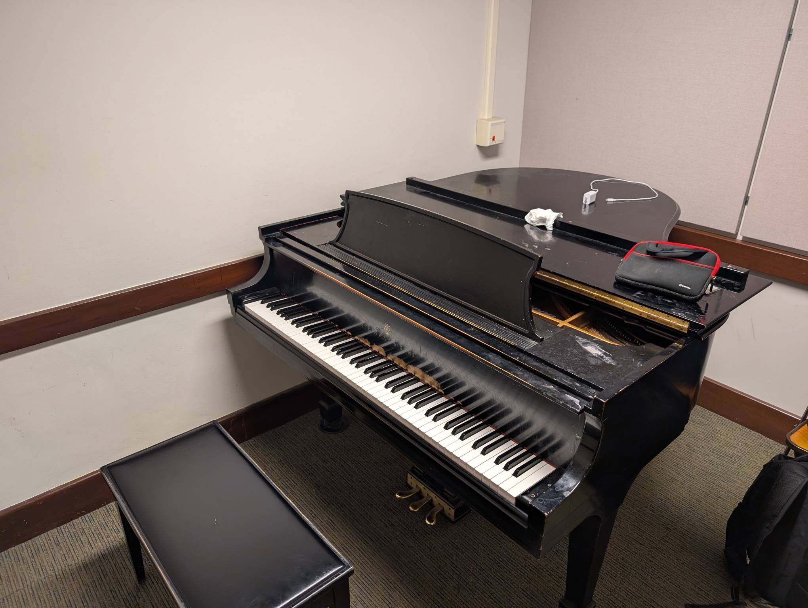

Rm 319
------

Playability: 2.

Room 319, third floor South practice rooms. Steinway Model M.

Voicing is quite loud. Notes become harsh quickly. Quiet playing is not very
mellow, and key weight is uneven. Loud playing feels "cheap". Some notes aren't
perfectly tuned.

*Last updated: Jan 26, 2026*

.. audio:: ../_static/audio/smith/319.mp3

