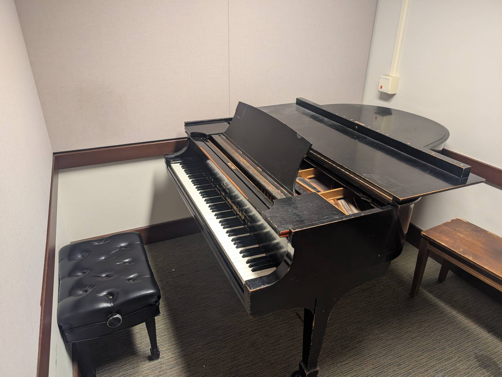

Rm 332
------

Playability: 2.

Steinway Model M.

Tone is sonorous. Some notes are out of tune. The voicing is quite hard, and
playing softly is difficult.

*Last updated: Feb 3, 2026*

.. audio:: ../_static/audio/smith/332.mp3

   Liszt Petrarch Sonnet 1:

