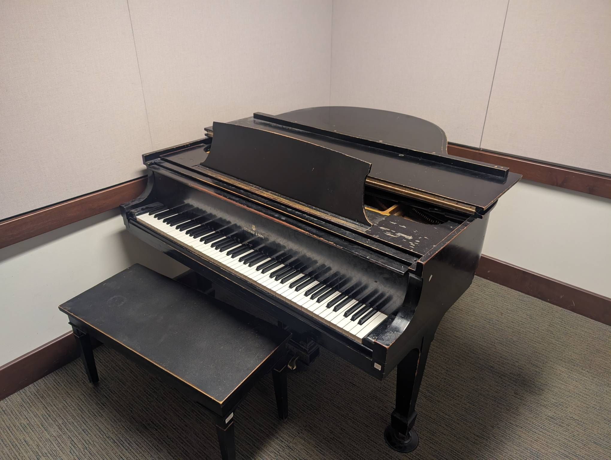

Rm 336
------

Playability: 1.

Steinway Model S.

Most notes are out of tune. Voicing is very hard and unpleasant. Difficult to
play softly. Loud playing is metallic, and most notes are heard loudly, even
when intended to be in the background.

*Last updated: Feb 3, 2026*

.. audio:: ../_static/audio/smith/336.mp3

   Liszt Petrarch Sonnet 1:

