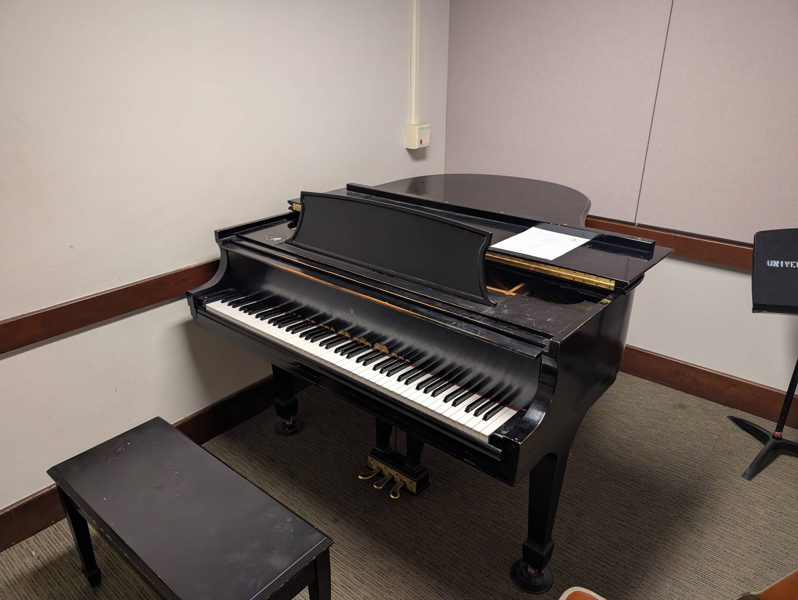

Rm 341
------

Playability: 4.

Steinway Model M.

Most notes are in tune. Tone for light and medium playing is great. Low notes
ring well, and melody notes are clear. When playing loud, low notes sound dull
and high notes harsh, but that is expected of a small piano.

*Last updated: Mar 17, 2026*

.. audio:: ../_static/audio/smith/341.mp3

   Composition:

