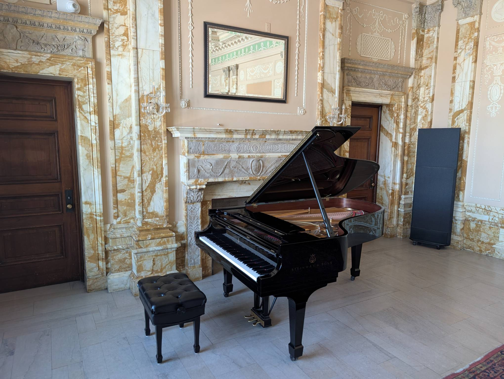

Smith Memorial Room
-------------------

Playability: 5.

The Smith Memorial Room is a large room on the second floor of the building,
with the entrance on the north side. It contains a Steinway Model B.
The room is rather detailed and beautiful, with marble walls and chandeliers.
The room has a good amount of reverb.

Voicing and tuning are very even and consistent. The dynamic range of volume and
tone is great: Soft playing is very mellow, and loud playing is brilliant but
not harsh. The piano is slightly on the louder side --- moderate finger
pressures will create louder sounds. When the low notes are played loudly, the
tone can feel "cheap" instead of "sonorous", but not to a bad extent.

The recording below has no reverb added; all reverb is due to the room.

*Last updated: Jan 26, 2026*

.. audio:: ../_static/audio/smith/MemRm.mp3

